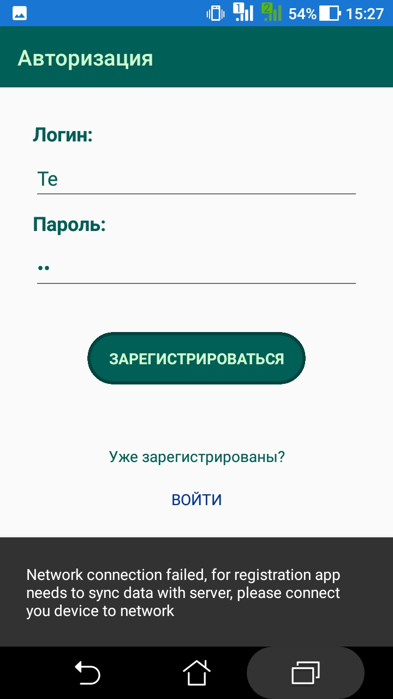
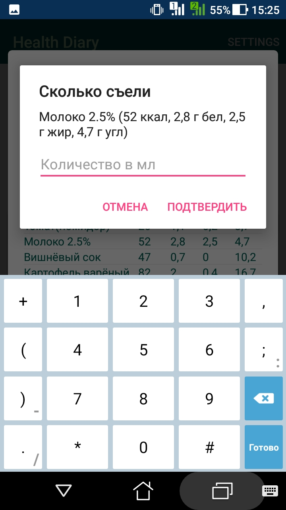
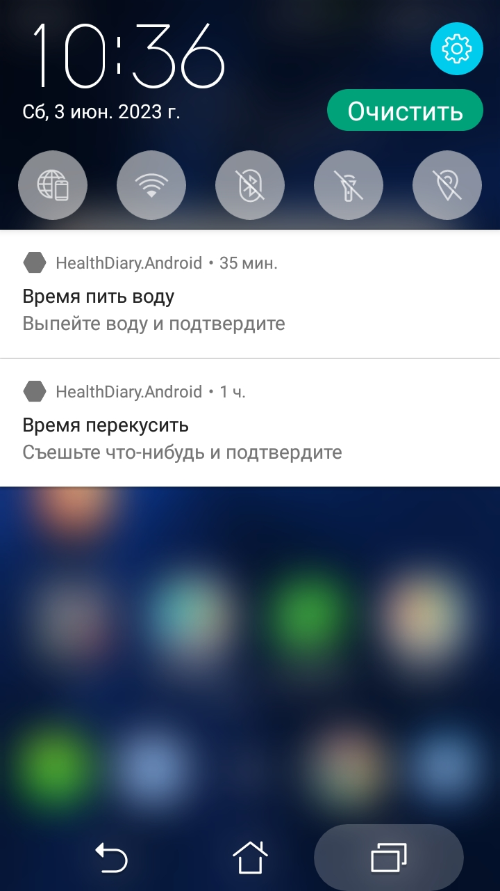
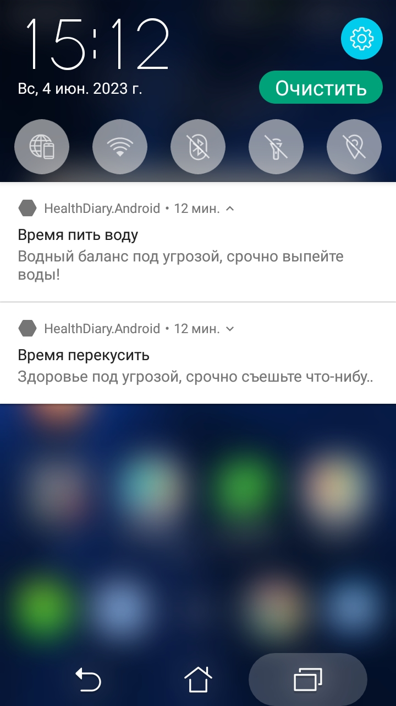

<h1 align="center">Health Diary</h1>

## Description

This mobile application allows you to monitor the amount of calories, proteins, fats, carbohydrates and water consumed.
 
The app has a data store of the energy value of foods, a meal builder with a calorie calculator and calculates an individual consumption plan.
 
The app also sends notifications to users when they need to drink water.

## About

### Xamarin Forms

This project created with Xamarin Forms.

### MVVM

The project architecture is based on the MVVM pattern.

### Data storage

The main application data such as information about products, users and their statistics are stored on the remote database server.
 
Some data from remote server is cached in the local SQLite storage.

### Web server

The application communicates with a remote database via a web server.

### Server synchronisation

`HttpSynchronizer` is used to communicate the application with the web server.

### Notifications

The application notifies users via toast messages and local push notifications.
 
Toast messages are used to notify about errors and successes of operations, such as synchronising data from the server.
 
`NotyScheduleService` creates and triggers the sending of local push notifications.

### Some screenshots

<table>
  <tr>
    <td></td>
    <td></td>
  </tr>
  <tr>
    <td></td>
    <td></td>
  </tr>
</table>

## Future scope

- [ ] Code refactoring
- [ ] Interface redesign
- [ ] Add notification schedule settings
- [ ] Add multi-language localisation